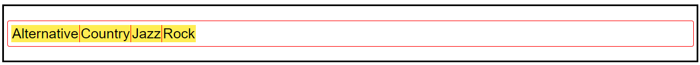

### overflow的作用

- [清除浮动](http://nicolasgallagher.com/micro-clearfix-hack/)
- [Why does overflow hidden stop floating elements escaping their container?](https://stackoverflow.com/questions/9193214/why-does-overflow-hidden-stop-floating-elements-escaping-their-container)
- [理解CSS中的块级格式化上下文](http://web.jobbole.com/83149/)
`overflow: hidden`只是创建BFC的方式之一，比较常用。
- `display: table` 可能引发响应性问题
- `overflow: scroll` 可能产生多余的滚动条
- `float: left` 将把元素移至左侧，并被其他元素环绕
- `overflow: hidden` 将裁切溢出元素